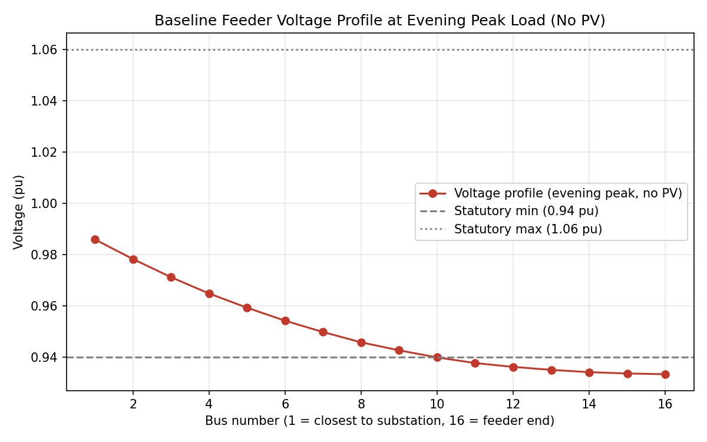
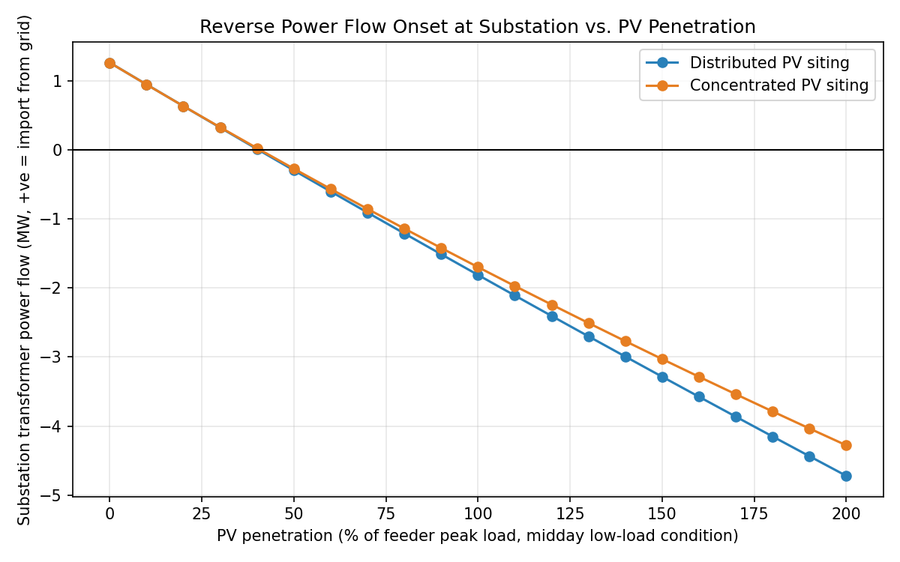
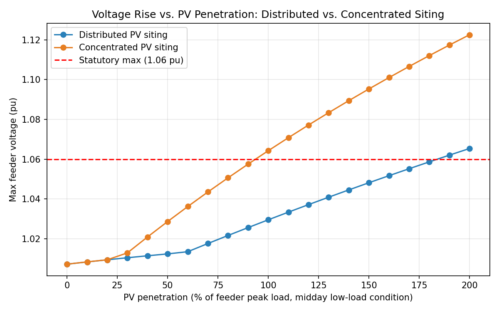
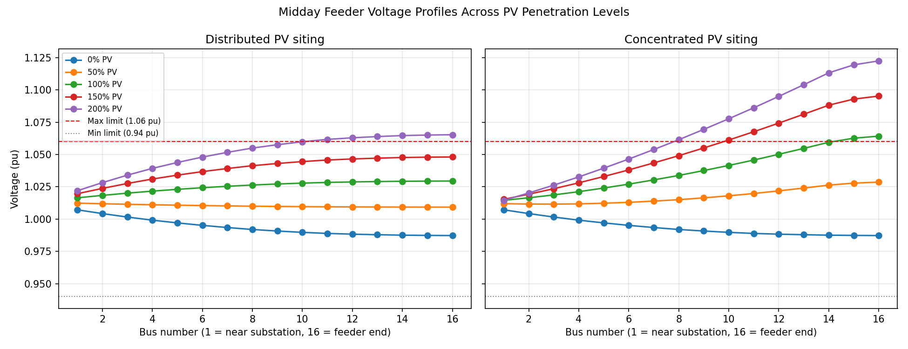

# gridpen

Power flow study on a radial 11 kV distribution feeder, built with pandapower.
Looks at two separate problems that get lumped together a lot in casual
discussion but are actually distinct: a feeder that's undervoltage at peak
load with zero solar involved, and a feeder that goes overvoltage at midday
once rooftop PV is added — and how much *where* you put that PV changes the
second problem.

## Background

Most "renewable integration" writeups I'd seen jumped straight to "adding
solar causes voltage rise," which is true but incomplete — it skips past
the fact that a lot of rural/semi-urban 11 kV feeders in India already sit
close to their voltage limits at peak load, before any solar enters the
picture. I wanted a model that could show both problems side by side and
make clear they don't have the same fix.

## The feeder

A 33/11 kV substation feeding a single radial spine of 16 buses, carrying a
mixed residential/agricultural/small-commercial load (~3.1 MW at peak).
Line parameters are set to match a typical ACSR conductor, and the load is
weighted heavier near the substation and sparser toward the tail, which is
roughly how these feeders actually look.

```python
# src/network.py builds this in pandapower
net = pp.create_empty_network()
bus_hv = pp.create_bus(net, vn_kv=33.0)
pp.create_ext_grid(net, bus=bus_hv, vm_pu=1.02)
# ... substation transformer, then 16 buses in a radial chain
```

## What gets tested

**Evening peak, no solar.** Full load, no generation anywhere on the feeder.
This just checks whether the feeder can hold statutory voltage limits
(0.94–1.06 pu) on its own load alone.

**Midday, low load, rising solar.** Load is scaled down to 40% of peak (a
reasonable daytime factor for a feeder that peaks in the evening), and PV
capacity is swept from 0% up to 200% of the feeder's peak load. This is
run twice — once with PV spread across all 16 buses in proportion to each
bus's own load, and once with PV all clustered onto the last 3 buses at the
tail end, since that's a common real pattern (that's usually where the
open land or big rooftops are).

## What came out of it

The feeder sags to **0.933 pu** at the tail end during evening peak — already
below the 0.94 pu floor — with no solar anywhere in the picture. That's just
line resistance over a long, thin radial spine. In practice this is a
conductor/regulator problem, not something rooftop solar caused or could fix.



Once you start adding midday solar, the first thing that happens isn't a
voltage violation — it's reverse power flow through the substation
transformer, which kicks in at around 50% penetration for either siting
strategy. The grid starts absorbing power from the feeder rather than
supplying it, well before voltage becomes an issue.



The part I found most useful is how much siting matters for hosting
capacity. Clustering PV at the tail end pushes the feeder past the 1.06 pu
ceiling at around 100% penetration. Spreading the same total PV capacity
across all 16 buses doesn't hit that ceiling until roughly 190% — almost
double the headroom for exactly the same amount of installed solar.



Looking at the full voltage profile along the feeder makes the mechanism
obvious — concentrated PV creates one big local voltage bump right at the
injection point, while distributed PV spreads that same effect thin enough
across the whole feeder that no single bus gets pushed too far.



## Layout

The whole thing is two source files plus one script that ties them together:

- `src/network.py` builds the feeder topology and load profile.
- `src/pv_integration.py` handles adding PV (either siting strategy), scaling
  load for the midday case, and running the actual power flow.
- `run_study.py` calls both of the above across all the scenarios, and drops
  the charts into `charts/` and the raw numbers into `outputs/`.

To run it:
```
pip install -r requirements.txt
python run_study.py
```

## Where this is weaker than a real study

This models two fixed snapshots in time, not a full year of hourly data —
a proper hosting capacity study would sweep an entire annual load and
irradiance profile rather than two representative points. I chose two
snapshots deliberately, to keep the undervoltage and overvoltage stories
separate and readable, rather than blending them into one noisy time
series.

It's also strictly a steady-state voltage study. pandapower's power flow
solver doesn't touch frequency response, inverter control dynamics, or
rotor behavior — "stability" here means bus voltage magnitude, nothing
more. A real frequency-stability study needs a dynamic simulation tool
(DIgSILENT PowerFactory, PSS/E, or PyPSA's time-domain extensions). I'd
originally planned to use PyPSA for this project, but pandapower's handling
of radial/unbalanced distribution feeders turned out to be a better fit for
what I was actually trying to show.

The network parameters — line impedances, transformer rating, load sizes —
are realistic but synthetic, not pulled from an actual DISCOM feeder. The
qualitative conclusions (siting matters, reverse flow shows up before
voltage does, weak feeders sag at peak regardless of solar) should hold up
generally; the exact percentages are specific to this particular feeder and
would shift with a different conductor gauge or load mix. PV is also
modeled at unity power factor with no reactive power support from
inverters — a real mitigation study would test Volt-VAR control before
recommending network upgrades.

## CV bullet

**Power Flow & Renewable Integration Study on a Distribution Feeder** (gridpen) — Self Project in Power Systems Engineering — Github
- Built a synthetic 11 kV radial distribution feeder in pandapower and ran Newton-Raphson AC power flow to identify a structural peak-load undervoltage condition (0.933 pu, below the 0.94 pu statutory floor) independent of any renewable generation.
- Modeled a rooftop-solar penetration sweep (0-200% of feeder peak load) under two siting strategies, showing distributed PV placement roughly doubles safe hosting capacity (190% vs. 100% penetration before breaching the 1.06 pu statutory voltage ceiling) and that reverse power flow through the substation transformer begins well before any voltage limit violation (~50% penetration).
